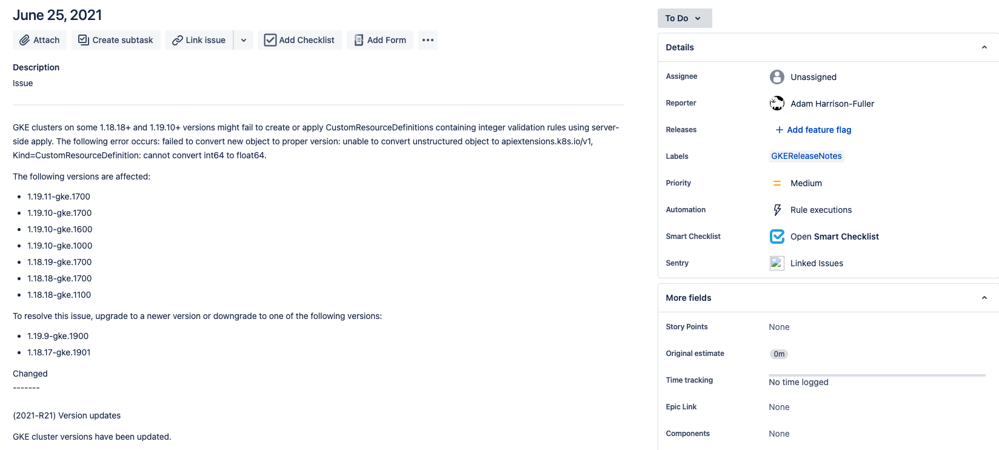
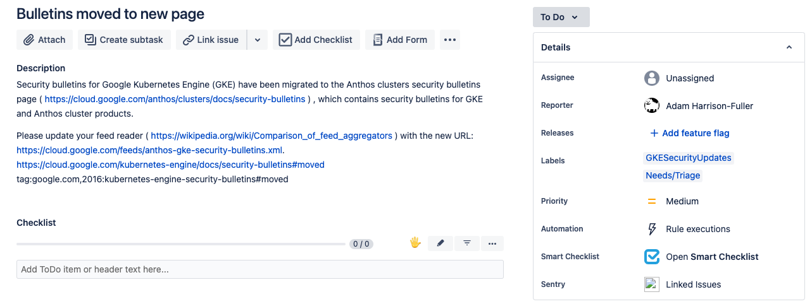

# Jira RSS Sync


Create Jira issues from RSS Feeds with optional labelling.  Created to monitor RSS feeds and bring posts to
our attention (Security Releases, Product Updates etc)

## Avoiding Duplication
We try to be as clever as is reasonably possible in terms of not duplicating RSS feed items into Jira.
A Redis database is used to store the GUID/FeedID combination which is checked when assessing articles for synchronisation.
Before synchronising an RSS item we run an issue search in the associated project, if we dont find the Title in any issue we assume its not already been created.
This helps to guard against scenarios where you lose the Redis database and dont want RSS items reduplicating into Jira.
If found in Jira it is marked as synchronised in the Redis database as well as printing an link to the existing issue(s) to stdout.

## Limiting what is initially synced.
Each feed entry in the config file can have an "added_since" property set.  This is used to only sync RSS items that have a
Published/Updated date greater than the provided value.  This can be useful on RSS feeds where you dont want to import historic items,
just new posts going forward.

## Config file

The config file **MUST** be named config.yaml, an example one is provided [here](config.yaml.example).  Below is a brief
 description of its contents.

```yaml
interval: 300
feeds:
  - id: test 
    feed_url: http://example.com/rss.xml
    name: Test Feed
    jira_project_id: TEST
    added_since: "2019-03-27T15:00:00Z"
    labels:
      - TestLabel
   - id: feed2
     ...
```
### Global
| Attribute | Type | Required | Description                                 |
|-----------|------|----------|---------------------------------------------|
| interval  | int  | yes      | The interval in seconds between feed checks |

### Feeds
| Attribute         | Type   | Required | Default | Description                                                                                              |
|-------------------|--------|----------|---------|----------------------------------------------------------------------------------------------------------|
| id                | string | yes      | n/a     | A feed ID that is used internally for duplicate detection.                                               |
| feed_url          | string | yes      | n/a     | The URL of the feed                                                                                      |
| name              | string | yes      | n/a     | A User friendly display name.                                                                            |
| jira_project_id   | string | yes      | n/a     | The Jira project ID to create issues under.                                                            |
| added_since       | string | no       | null    | For longer RSS feeds specify a ISO 8601 DateTime to exclude items published/updated earlier than this    |
| labels            | Array  | no       | []      | A list of labels to add to created Issues                                                                |

## Docker
A Docker image is made available on [DockerHub](https://hub.docker.com/r/adamhf/gitlabrsssync)

### Relevant Environment Variables
* JIRA_URL - The base Jira URL used
* JIRA_USERNAME - The username you wish to authenticate as.
* JIRA_API_TOKEN - A Jira API token associated with the account specified in JIRA_USERNAME.  These can be generated from https://id.atlassian.com/manage/api-tokens
* CONFIG_DIR - The directory the application should look for config.yaml in.
* REDIS_PRIMARY_ENDPOINT - The endpoint for the Redis host/cluster. This should not include the port
* REDIS_PORT - The port to access the Redis host/cluster. If unset, the client defaults to port 6379
* REDIS_PASSWORD - Password for Redis, if an empty password is required set to `REDIS_PASSWORD=`
* REDIS_AUTH_TOKEN - The auth token for the redis Elasticache cluster if being used.
**Note: One of REDIS_PASSWORD or REDIS_AUTH_TOKEN must be set **
* REDIS_SSL - Used as a feature toggle on whether to configure tls in the redis client. When set to 1, TLS config is enabled

### Run it

#### Via Docker
```bash
docker run -e JIRA_URL=<INSERT_URL> -e JIRA_USERNAME=<INSERT_USERNAME> -e JIRA_API_TOKEN=<INSERT_TOKEN> -e CONFIG_DIR=/app -v REDIS_URL=<REDIS_URL> -v REDIS_PASSWORD=<REDIS_PASSWORD> -v ${PWD}:/config adamhf/rss-sync:latest
```

#### Via docker-compose
Populate the .env file with the appropriate real values.
```bash
docker-compose up
```

## Prometheus Metrics
Two metrics (above and beyond what are exposed by the Go Prometheus library) are exposed on :8080/metrics
* last_run_time - The time of the last feed checks, useful for creating alerts to check for successful runs.
* issue_creation_total - The total number of issues created in Jira, useful to check for runaways.
* issue_creation_error_total - The total number of failures of issue creation in Jira.

## Healthz Endpoint
A /healthz endpoint is exposed on :8080/healthz which will fail if it is unable to connect to Redis.

## Example Issues
### GKE Release Notes
Feed URL: https://cloud.google.com/feeds/kubernetes-engine-release-notes.xml

### GKE Security Updates
Feed URL: https://cloud.google.com/feeds/kubernetes-engine-security-bulletins.xml

